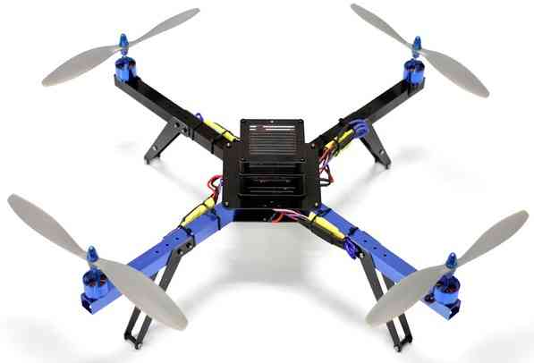
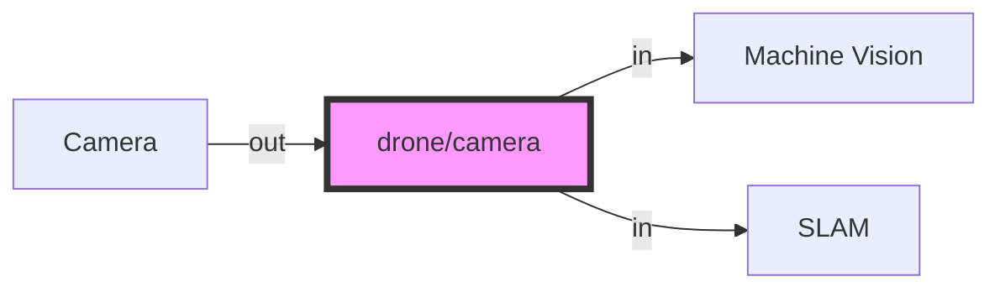
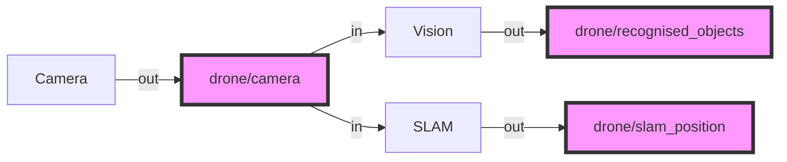

# ROS2 and UAV Control

This tutorial gives a brief overview and background on UAV Control and ROS2. By the end you should have a brief understanding of how a UAV is controlled, how Starling treats a UAV and why and how we use ROS2 to communicate with a UAV.

[TOC]

## A Brief Introduction to UAV Control

### What is a UAV or a Drone

A drone or unmanned aerial vehicle (UAV) is an unmanned "robotic" vehicle that can be remotely or autonomously controlled.

Drones are used for many consumer, industrial, government and military applications (opens new window). These include (non exhaustively): aerial photography/video, carrying cargo, racing, search and surveying etc.

> Different types of drones exist for use in air, ground, sea, and underwater. These are (more formally) referred to as Unmanned Aerial Vehicles (UAV), Unmanned Aerial Systems (UAS), Unmanned Ground Vehicles (UGV), Unmanned Surface Vehicles (USV), Unmanned Underwater Vehicles (UUV).

The "brain" of the drone is called an *autopilot*. It consists of flight stack software running on vehicle controller ("flight controller") hardware.

A *multi-rotor* is a specific type of UAV which uses two of more lift-generating rotors to fly. One of the most common will be the Quadrotor which has 4 motors in an 'X' pattern. These UAVs provide much simpler flight control than other types of aerial vehicle. This tutorial focuses on the flight of a simple quadrotor, but Starling can be used to operate many different types of robot.

> From this point on in this tutorial, 'drone' or 'UAV' will refer to a multi-rotor UAV unless otherwise stated.

### How do you control a UAV

> Modified from [ardupilot docs](https://ardupilot.org/copter/docs/what-is-a-multicopter-and-how-does-it-work.html)

A multicopter is a mechanically simple aerial vehicle whose motion is controlled by speeding or slowing multiple downward thrusting motor/propeller units. Combining different thrusts on different rotors allows the vehicle to move in free space with 6 degrees of freedom.

However, manually controlling the individual thrusts of each motor in order to move the UAV is incredibly difficult, most would say its impossible even. This instability means that an on-board computer is mandatory for stable flight, as the on-board controller can perform the extreme high-rate control required to keep the drone in the air. In this "Fly by wire" paradigm, if the computer isn't working, you aren't flying.

This dedicated on-board controller is referred to as the *autopilot*. This is seperate from a companion computer which is often used to direct the autopilot to achieve higher level mission goals. The autopilot combines data from small on-board MEMs gyroscopes and accelerometers (the same as those found in smart phones) to maintain an accurate estimate of its orientation and position.



The quadcopter shown above is the simplest type of multicopter, with each motor/propeller spinning in the opposite direction from the two motors on either side of it (i.e. motors on opposite corners of the frame spin in the same direction).

A quadcopter can control its roll and pitch rotation by speeding up two motors on one side and slowing down the other two. So for example if the quadcopter wanted to roll left it would speed up motors on the right side of the frame and slow down the two on the left. Similarly if it wants to rotate forward it speeds up the back two motors and slows down the front two.

The copter can turn (aka “yaw”) left or right by speeding up two motors that are diagonally across from each other, and slowing down the other two.

Horizontal motion is accomplished by temporarily speeding up/slowing down some motors so that the vehicle is leaning in the direction of desired travel and increasing the overall thrust of all motors so the vehicle shoots forward. Generally the more the vehicle leans, the faster it travels.

Altitude is controlled by speeding up or slowing down all motors at the same time.

In order to automatically map higher level motions to the thrust of the rotors, a cascading set of PID controllers is designed and provided by the autopilot. These then allow the remote control flight of the vehicle from a transmitter in your pilots hands, or via messages sent by the companion computer

### The Autopilot

There is no universal controller design of converting from user inputs to motor thrust. In the same way, there are numerous other functionalities that an autopilot can cover. These can range from running control loops for gimbals, cameras and other actuation, to high level mission following and safety features. These functionalities are bundled into specific autopilot *firmwares* which each offer a slightly different set of features, as well as differing user interfaces each with their advantages and drawbacks.

The two current most common autopilot firmware's in use in research settings are [Ardupilot](https://ardupilot.org/copter/index.html) which offers the Arducopter firmware, and [PX4](https://px4.io/) which offers Multicopter firmware. Both these firmwares are very extensive and cover numerous use cases. However, for our purposes we will only cover enabling autonomous flight through observing the *mode* of the autpilot.

Both Ardupilot and PX4 use the concept of flight modes, where each mode operates a supports different levels or types of flight stabilisation and/or autonomous functions. Traditionally this is for pilots to change between different controller layouts for different applications. It's necessary to change to the correct mode for safe and controllable flight. The following table shows the most often used flight modes within Starling.

| [Ardupilot Mode](https://ardupilot.org/copter/docs/flight-modes.html) 	| [PX4 Mode](https://docs.px4.io/v1.12/en/getting_started/flight_modes.html)  	| Functionality                                                                                 	|
|----------------	|-----------	|-----------------------------------------------------------------------------------------------	|
| stabilized     	| manual    	| Full manual control with RC sticks being sent directly to control roll, pitch, yaw and height 	|
| PosHold        	| position  	| UAV uses onboard sensing to stay in place, RC sticks used to translate position               	|
| loiter         	| auto.hold 	| Automatic mode where UAV stays in the same location until further instructions given.         	|
| land           	| auto.land 	| Automatic mode which attempts to land the UAV                                                 	|
| Guided         	| offboard  	| Navigates to setpoints sent to it by ground control or companion computer                     	|

> Our controllers will all ask the autopilot to switch into guided or offboard mode in order to control from the companion computer. Often they have safety elements build in which mean that the autopilot must receive instructions at a certain rate (2Hz) otherwise the autopilot will switch to loiter or land.

As mentioned before, the firmware provides a given cascading PID controller for converting high level commands to motor thrusts. As a controller developer, it is also useful to understand the differences between the Ardupilot and PX4 controllers and what real world impacts that has. Thankfully in most of Starling's targeted applications we only require position control which works fairly consistently between the two firmwares.

In our own work, it has generally been noted that Ardupilot seems to be more suitable for outdoor flight, and PX4 for indoor flight. For this tutorial we will be developing a controller for indoor multi-vehicle flight and so we will assume the use of PX4.

If interested in outdoor flight with Ardupilot, check out [this tutorial](https://github.com/StarlingUAS/fenswood_volcano_template) which uses Starling with Ardupilot to simulate outdoor drone flight over a volcano.

### MAVLink and Autopilot communication

Once in guided or offboard mode, the autopilot expects communications using the [MAVLINK protocol](https://mavlink.io/en/messages/common.html). Traditionally this would have been used for a ground control station (GCS) to send commands to a UAV over a telemetry link. However, now it has also developed into a protocol for commanding the autopilot from an onboard companion computer over a USB or serial connection too. In Starling, both methods of communication between GCS or companion computer are supported.

The MAVLink protocol is a set of preset commands which compatible firmwares understand and react to. However, it is often verbose and not-intuitive to develop applications with, as well as requiring a lot of prior knowledge about the state of the system. For example, it is neccesary to send a number of specific messages in order to receive individual data streams on vehicle status, location, global location and so on. These are often missed and cause lots of headaches for developers. Starling aims to streamline this through the use of the Robot Operating System so users no longer need to interact with MAVLink and the autopilot directly.

## A Brief Introduction to ROS

This sections is adapted from [this article](https://dev.to/caelinsutch/a-brief-introduction-to-the-robot-operating-system-ros-15m5)

ROS stands for the Robot Operating System, yet it isn't an actual operating system. It's a framework designed to expedite the development time of robot platforms. To understand what ROS is, we should understand why ROS exists in the first place.

## Why does ROS exist?

In general, software developers avoid hardware like the plague. It's messy, doesn't have consistent behavior, and there's no ctrl-z in sight.

Most beginner programmers think you have to have a deep knowledge of electronics and even mechanics to program robots. They think that the hardware and software are so tightly coupled, you have to know both in depth to build anything useful.

Software developers became software developers for a reason, so they don't have to deal with hardware. For example, lets say you have to debug a faulty sensor. You first have to take out the sensor from the enclosure, test the sensor thoroughly with a multi meter and various test cases, document its behavior, then examine the hardware -level code to ensure that there were no bugs, and so on. That's a lot of interaction with the hardware that's not fun for someone who just wants to write some cool software.

It's harder to attract good programmers if the programming is coupled deeply with hardware. This is where ROS comes into play. With ROS, you can completely abstract the hardware from software, and instead interact with an API that gives access to that data. You can forget about the hardware, and focus on developing the software that makes the robot do what you want.

## What is ROS

ROS is essentially a framework that sits on top of an operating system which defines how particular ROS compatible programs communicate and share data with each other. Essentially ROS defines an interface between which compatible programs can communicate and interact with each other. Over the years that ROS has existed, many people have developed thousands of ROS compatible packages which can be used in a modular fashion.

## ROS concepts through an example

To make it more concrete, imagine that on your drone you have a camera. There are also two processes which require, as inputs, that camera image. Say, a machine learning program, and a position estimation program. Traditionally, you would have to manually serialise (compress) and stream the image over a port which the other two programs could read from. But if the port changes or, say, the camera changes, lots of things have to be reconfigured.

However, this sort of interaction can be made streamlined in ROS. Let us consider the programs we have as ROS **nodes**, i.e. a program which is responsible for one single modular purpose, with particular inputs or outputs:

1. A camera image streaming node
    - OUT: camera image
2. A machine vision system for recognising objects
    - IN: camera image
    - OUT: list of recognised objects
3. A simultaneous localisation and mapping system.
    - IN: camera image
    - OUT: vehicle position

These outputs of a node define ROS **topics**, i.e. a single stream of one type of data. Each topic has a particular name which can be referred to. In our example, some of the topics might be:

- `/drone/camera` for the camera image
- `/drone/recognised_objects` for the machine vision system
- `/drone/slam_position` for the SLAM system

Then, we see that there are two avenues of communication created from these node inputs and outputs.



Now ROS follows a **publisher/subscriber** model of communication. What that means is that nodes **publish** data to `topics` as outputs. But that data is only sent across the network if a different nodes also **subscribes** to the same topic. So in our example we end up having

1. A camera image streaming node
    - OUT: publishing to `/drone/camera`
2. A machine vision system for recognising objects
    - IN: subscribed to `/drone/camera`
    - OUT: publishing to `/drone/recognised_objects`
3. A simultaneous localisation and mapping system.
    - IN: subscribed to `/drone/camera`
    - OUT: publishing to `/drone/slam_position`



Finally, the data that is sent is not just anything. The data or **message** is a specifically templated packet of data containing things specified for that paricular use case. In our example for `/drone/slam_position` topic, the message might be of type [`geometry_msgs/msg/Point.msg`](https://github.com/ros2/common_interfaces/blob/master/geometry_msgs/msg/Point.msg) which is defined like so:
```
# This contains the position of a point in free space
float64 x
float64 y
float64 z
```
In other words the message that the `/drone/slam_position` topic publishes must have a `msg.x`, `msg.y` and `msg.z` field, and the subscriber will only receivea message with those fields. There are a number of messages in the standard ROS library, but many libraries also define their own - as have we in some parts of Starling.

This can be summarised in this diagram from the [ROS tutorials](https://docs.ros.org/en/foxy/Tutorials/Understanding-ROS2-Nodes.html) demonstrates it very nicely:


The bottom half of this shows how topics get sent from a publisher to a subscriber.

Interestingly, if you put two topics together, you get some notion of two way communication. This is the basis of a **service** which can be seen in the top of the diagram. A **service** is made of a Request topic and a Response topic, but functions as a single communication type to the user. Similar to messages, a service has a defined request and response types (e.g. see [`std_srvs/srv/SetBool.srv`](https://github.com/ros2/common_interfaces/blob/master/std_srvs/srv/SetBool.srv)).  A service request will often wait until a response is received before continuing.

Note that everything happens asyncronously and in parallel, when a node subscribes or sends a requests, it doesn't know when the response will arrive. It only knows it will (hopefully) arrive at some point. When a packet is received the subscriber can then run a method - this method is usually known as a **callback**, but that will be covered in a later tutorial.

So in summary, the key conepts and terminology are:

- **Nodes**
- **Topics**
- **Publishers and Subscribers**
- **Messages**
- **Services**

## ROS2 for Starling
There are 2 versions of ROS - ROS1 and ROS2. ROS1, initially created in 2007 by Willow Garage, has become huge among the open source robotics community. However over the years they realised that there are a number of important features which are missing - and adding all of these would simply break ROS1. Also the most recent ROS1 distribution (ROS Noetic) is soon to reach the end of its supported life (EOL 2025) with no more ROS1 there after! (See [this article](https://roboticsbackend.com/ros1-vs-ros2-practical-overview/#Why_ROS2_and_not_keep_ROS1) for more details!)

Therefore, to future proof the system, and to ensure all users get a well rounded experience that will hopefully translate to industry experience, Starling has been implemented in ROS2. Specifically, Starling uses the **Foxy Fitzroy** Long Term Support (LTS) distribution throughout.

There are some interesting changes between ROS1 and ROS2, but the core elements described above remain identical. A future tutorial will go into a few more details, but this is probably all the context you will need for now!

> **Note:** Main thing to be aware of is if you are debugging and searching for ROS questions on the internet, be aware that there are many existing questions for ROS1 which will no longer apply for ROS2.


### MAVLINK and ROS with MAVROS

Coming back round to flying drones, we mentioned in [](#mavlink-and-autopilot-communication) that we wanted to use ROS to avoid having to manually communicate with the autopilot using MAVLINK. Starling uses the [**MAVROS** ROS package](http://wiki.ros.org/mavros) to do exactly that.

For the autpilot, it automatically sets up a connection and translates higher level ROS commands into MAVLINK commands.

For controller developers, Mavros provides a known and consistent interface through a set of topics, services and parameters to interact with. These include high level actions such as requesting the vehicle's state, local position, gps position, as well as setting setpoints for the vehicle to visit. A couple of useful topics are in the following table:

| Name                 	| Topic                          	| Message Type                   	| Functionality                                                                  	|
|----------------------	|--------------------------------	|-------------------------------	|--------------------------------------------------------------------------------	|
| State                	| mavros/state                   	| mavros_msgs/msg/State         	| Get's the current state and flight mode of the vehicle                         	|
| Local Position       	| mavros/local_position/pose     	| geometry_msgs/msg/PoseStamped 	| Get the UAVs current coordinate position after sensor fusion                   	|
| GPS Position         	| mavros/global_position/global  	| sensor_msgs/msg/NavSatFix     	| Get the UAVs current lat,long (if enabled)                                     	|
| Position Setpoint    	| mavros/setpoint_position/local 	| geometry_msgs/msg/PoseStamped 	| Send a target coordinate and orientation for the vehicle to fly to immediately 	|
| Set Flight Mode      	| mavros/set_mode                	| mavros_msgs/srv/SetMode       	| A service which sets the flight mode of the autopilot                          	|
| Set Data Stream Rate 	| mavros/set_stream_rate         	| mavros_msgs/srv/StreamRate    	| A service which starts the data stream from the autopilot and sets its rate    	|

Sometimes, you may need to send raw MAVlink back to the Autopilot to enable some non-standard functionality. This can also be done through the MAVROS node too.

As we are now utilising ROS, this allows us to make the most of the full ROS ecosystem in developing UAV applications.

## Next Steps

Hopefully now you have a basic understanding of what a drone is and how they are controlled, the function and purpose of an autopilot, as well as how ROS functions can be used. If you want some early hands on experience with ROS before delving further into Starling, we highly recommend the [offical ros2 tutorials](https://docs.ros.org/en/foxy/Tutorials.html).

We have one more theory topic before you can start creating your own Starling projects, where we will be discussing how Starling uses and encapsulates ROS functionality.