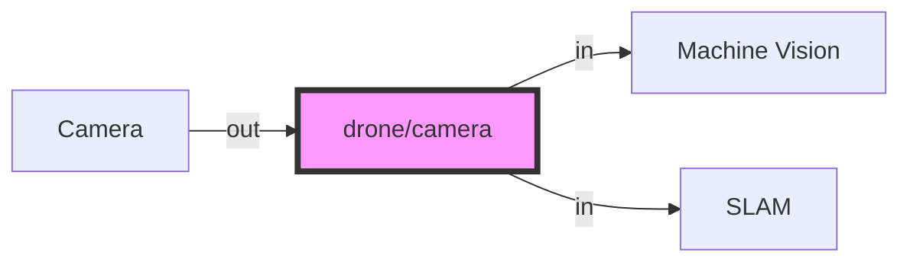
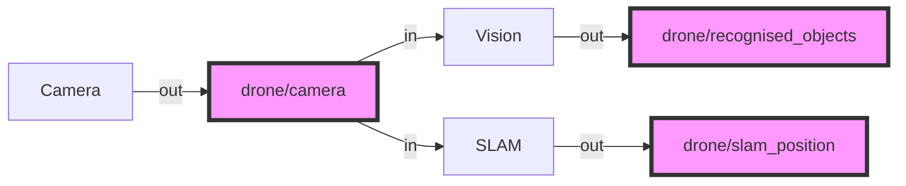

# A Brief Introduction to ROS

This sections is adapted from [this article](https://dev.to/caelinsutch/a-brief-introduction-to-the-robot-operating-system-ros-15m5)

ROS stands for the Robot Operating System, yet it isn't an actual operating system. It's a framework designed to expedite the development time of robot platforms. To understand what ROS is, we should understand why ROS exists in the first place.

## Why does ROS exist?

In general, software developers avoid hardware like the plague. It's messy, doesn't have consistent behavior, and there's no ctrl-z in sight.

Most beginner programmers think you have to have a deep knowledge of electronics and even mechanics to program robots. They think that the hardware and software are so tightly coupled, you have to know both in depth to build anything useful.

Software developers became software developers for a reason, so they don't have to deal with hardware. For example, lets say you have to debug a faulty sensor. You first have to take out the sensor from the enclosure, test the sensor thoroughly with a multi meter and various test cases, document its behavior, then examine the hardware -level code to ensure that there were no bugs, and so on. That's a lot of interaction with the hardware that's not fun for someone who just wants to write some cool software.

It's harder to attract good programmers if the programming is coupled deeply with hardware. This is where ROS comes into play. With ROS, you can completely abstract the hardware from software, and instead interact with an API that gives access to that data. You can forget about the hardware, and focus on developing the software that makes the robot do what you want.

## What is ROS

ROS is essentially a framework that sits on top of an operating system which defines how particular ROS compatible programs communicate and share data with each other. Essentially ROS defines an interface between which compatible programs can communicate and interact with each other. Over the years that ROS has existed, many people have developed thousands of ROS compatible packages which can be used in a modular fashion.

## ROS concepts through an example

To make it more concrete, imagine that on your drone you have a camera. There are also two processes which require, as inputs, that camera image. Say, a machine learning program, and a position estimation program. Traditionally, you would have to manually serialise (compress) and stream the image over a port which the other two programs could read from. But if the port changes or, say, the camera changes, lots of things have to be reconfigured.

However, this sort of interaction can be made streamlined in ROS. Let us consider the programs we have as ROS **nodes**, i.e. a program which is responsible for one single modular purpose, with particular inputs or outputs:

1. A camera image streaming node
    - OUT: camera image
2. A machine vision system for recognising objects
    - IN: camera image
    - OUT: list of recognised objects
3. A simultaneous localisation and mapping system.
    - IN: camera image
    - OUT: vehicle position

These outputs of a node define ROS **topics**, i.e. a single stream of one type of data. Each topic has a particular name which can be referred to. In our example, some of the topics might be:

- `/drone/camera` for the camera image
- `/drone/recognised_objects` for the machine vision system
- `/drone/slam_position` for the SLAM system

Then, we see that there are two avenues of communication created from these node inputs and outputs.



Now ROS follows a **publisher/subscriber** model of communication. What that means is that nodes **publish** data to `topics` as outputs. But that data is only sent across the network if a different nodes also **subscribes** to the same topic. So in our example we end up having

1. A camera image streaming node
    - OUT: publishing to `/drone/camera`
2. A machine vision system for recognising objects
    - IN: subscribed to `/drone/camera`
    - OUT: publishing to `/drone/recognised_objects`
3. A simultaneous localisation and mapping system.
    - IN: subscribed to `/drone/camera`
    - OUT: publishing to `/drone/slam_position`



Finally, the data that is sent is not just anything. The data or **message** is a specifically templated packet of data containing things specified for that paricular use case. In our example for `/drone/slam_position` topic, the message might be of type [`geometry_msgs/msg/Point.msg`](https://github.com/ros2/common_interfaces/blob/master/geometry_msgs/msg/Point.msg) which is defined like so:
```
# This contains the position of a point in free space
float64 x
float64 y
float64 z
```
In other words the message that the `/drone/slam_position` topic publishes must have a `msg.x`, `msg.y` and `msg.z` field, and the subscriber will only receivea message with those fields. There are a number of messages in the standard ROS library, but many libraries also define their own - as have we in some parts of Starling.

This can be summarised in this diagram from the [ROS tutorials](https://docs.ros.org/en/foxy/Tutorials/Understanding-ROS2-Nodes.html) demonstrates it very nicely:


The bottom half of this shows how topics get sent from a publisher to a subscriber.

Interestingly, if you put two topics together, you get some notion of two way communication. This is the basis of a **service** which can be seen in the top of the diagram. A **service** is made of a Request topic and a Response topic, but functions as a single communication type to the user. Similar to messages, a service has a defined request and response types (e.g. see [`std_srvs/srv/SetBool.srv`](https://github.com/ros2/common_interfaces/blob/master/std_srvs/srv/SetBool.srv)).  A service request will often wait until a response is received before continuing.

Note that everything happens asyncronously and in parallel, when a node subscribes or sends a requests, it doesn't know when the response will arrive. It only knows it will (hopefully) arrive at some point. When a packet is received the subscriber can then run a method - this method is usually known as a **callback**, but that will be covered in a later tutorial.

So in summary, the key conepts and terminology are:

- **Nodes**
- **Topics**
- **Publishers and Subscribers**
- **Messages**
- **Services**

## ROS2 for Starling
There are 2 versions of ROS - ROS1 and ROS2. ROS1, initially created in 2007 by Willow Garage, has become huge among the open source robotics community. However over the years they realised that there are a number of important features which are missing - and adding all of these would simply break ROS1. Also the most recent ROS1 distribution (ROS Noetic) is soon to reach the end of its supported life (EOL 2025) with no more ROS1 there after! (See [this article](https://roboticsbackend.com/ros1-vs-ros2-practical-overview/#Why_ROS2_and_not_keep_ROS1) for more details!)

Therefore, to future proof the system, and to ensure all users get a well rounded experience that will hopefully translate to industry experience, Starling has been implemented in ROS2. Specifically, Starling uses the **Foxy Fitzroy** Long Term Support (LTS) distribution throughout.

There are some interesting changes between ROS1 and ROS2, but the core elements described above remain identical. A future tutorial will go into a few more details, but this is probably all the context you will need for now!

> **Note:** Main thing to be aware of is if you are debugging and searching for ROS questions on the internet, be aware that there are many existing questions for ROS1 which will no longer apply for ROS2.